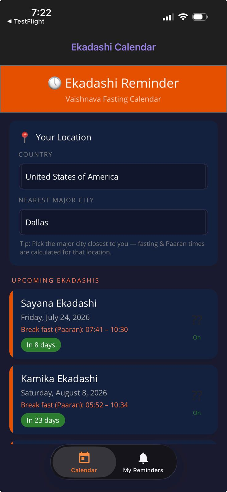
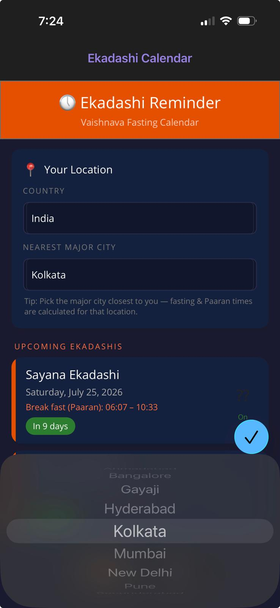
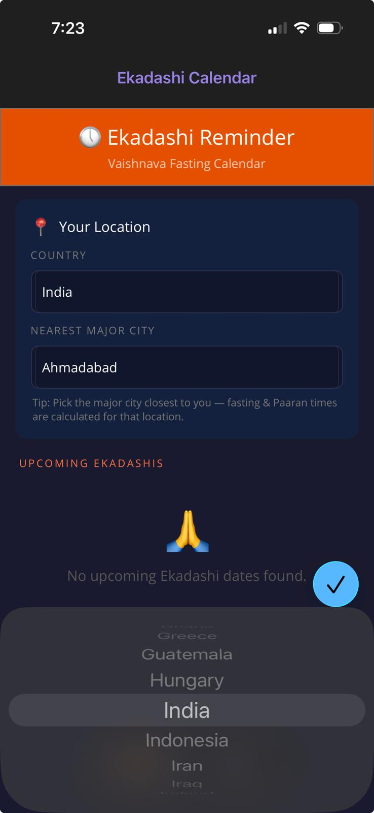

# Ekadashi Reminder

> A cross-platform .NET MAUI app that helps devotees never miss an **Ekadashi** fasting day - with accurate, location-based dates, break-fast (Paaran) timings, local notifications, and device-calendar integration.

[](https://github.com/anikapatwa4u/ekadashireminder/actions/workflows/ios-release.yml)
[](https://github.com/anikapatwa4u/ekadashireminder/actions/workflows/android-release.yml)

## Download

Ekadashi Reminder is live on both app stores:

<a href="https://apps.apple.com/us/app/ekadashi-reminder/id6789737835"></a>
&nbsp;
<a href="https://play.google.com/store/apps/details?id=com.anikapatwa.ekadashireminder"></a>

- **iOS (App Store):** https://apps.apple.com/us/app/ekadashi-reminder/id6789737835
- **Android (Google Play):** https://play.google.com/store/apps/details?id=com.anikapatwa.ekadashireminder

---

## Features

- **Accurate Ekadashi dates** for **215+ cities worldwide**, sourced from authentic Vaishnava calendar (iCal) data for 2026-2027.
- **Two-level location picker** (Country then City) so timings match your location.
- **Break-fast (Paaran) windows** shown for each Ekadashi.
- **Smart local notifications** - a day-before reminder plus a weekend "plan ahead" nudge.
- **Device calendar integration** - add fasting days to your native calendar with one tap.
- **Custom reminders** for your own special days.
- **Cross-platform** - iOS, Android, macOS (Mac Catalyst), and Windows from a single codebase.

## Screenshots

| Home / Next Ekadashi | Choose City | Choose Country |
|:---:|:---:|:---:|
|  |  |  |

## Architecture

The app follows a lightweight **MVVM** pattern with a clear separation between the UI,
view-models, and platform-independent services. See
[docs/ARCHITECTURE.md](docs/ARCHITECTURE.md) for the full diagram and design notes.

```
Pages (XAML)  -->  ViewModels  -->  Services  -->  Data (iCal files, Preferences)
   UI binding       state/logic     parsing        215+ city .ics + JSON
```

Key design decision: all iCal parsing lives in a **framework-independent core**
(ICalParserCore) with **no MAUI dependency**, so the most important logic is fully
**unit-tested** in a plain net10.0 test project.

## Tests

Meaningful unit tests live in [EkadashiReminder.Tests](EkadashiReminder.Tests) and cover
Ekadashi identification, date-parsing robustness, RFC 5545 line-folding, break-fast
linkage, and malformed-input handling.

```bash
dotnet test EkadashiReminder.Tests/EkadashiReminder.Tests.csproj
```

## Getting Started

### Prerequisites
- [.NET 10 SDK](https://dotnet.microsoft.com/download/dotnet/10.0)
- MAUI workload: `dotnet workload install maui`

### Build and Run
```bash
# Restore and build
dotnet build

# Run on a specific platform (example: Windows)
dotnet build -t:Run -f net10.0-windows10.0.19041.0
```

## CI/CD

Automated release pipelines build, sign, and upload the app with **no local Mac required**:

- **iOS** - [.github/workflows/ios-release.yml](.github/workflows/ios-release.yml)
  builds a signed .ipa on a macOS runner and uploads to TestFlight.
- **Android** - [.github/workflows/android-release.yml](.github/workflows/android-release.yml)
  builds a signed .aab and can auto-publish to Google Play.

Both pipelines auto-increment the build number from the GitHub run number.

## Motivation and What I Learned

I built Ekadashi Reminder because members of my family observe Ekadashi fasting and often
found it hard to track the correct dates and break-fast timings for their city. Existing
options were cluttered or inaccurate, so I wanted a **simple, reliable, personal app**.

Along the way I learned to:

- Build a **cross-platform app with .NET MAUI** targeting iOS, Android, Windows, and macOS.
- Parse real-world **iCal (RFC 5545)** data and handle its quirks (line folding, escaping,
  date-time variants) reliably.
- Design for **testability** by isolating pure logic from framework code.
- Set up **end-to-end CI/CD** - including Apple code-signing and Google Play publishing -
  entirely from a Windows machine using GitHub Actions.
- Navigate the full **App Store and Google Play submission** process (privacy policy,
  screenshots, export compliance, provisioning profiles, and review feedback).

## Project Structure

```
EkadashiReminder/
  EkadashiReminder/
    Models/          # EkadashiEvent, CustomReminder, LocationRegion
    Services/        # ICalParserCore (pure), ICalParser, data, notifications, calendar
    ViewModels/      # CalendarViewModel, AddReminderViewModel
    Pages/           # XAML pages
    Converters/
  EkadashiReminder.Tests/   # xUnit tests for the parser core
  Resources/Raw/ical/       # 215+ city .ics files (2026-2027)
  docs/                     # README assets, architecture, privacy and support pages
  .github/workflows/        # iOS and Android release pipelines
```

## License

This project is licensed under the **MIT License** - see the [LICENSE](LICENSE) file for
details. Calendar data is derived from publicly available Vaishnava calendar sources.

## Acknowledgements

- Vaishnava calendar data providers for the source iCal files.
- The .NET MAUI community.
- Thanks to family and friends who tested the app, gave feedback, and helped review the
  project along the way.